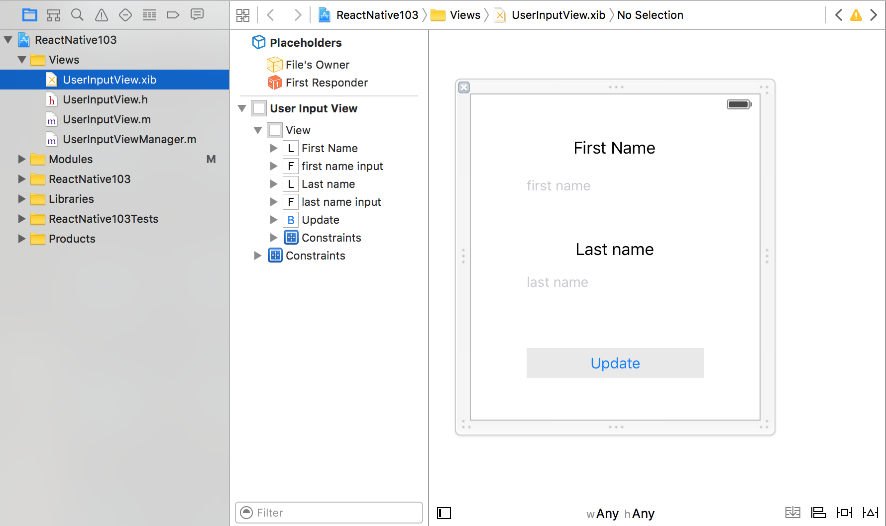
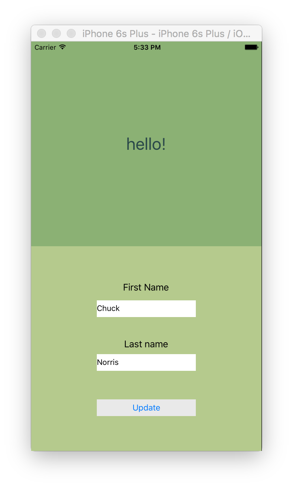
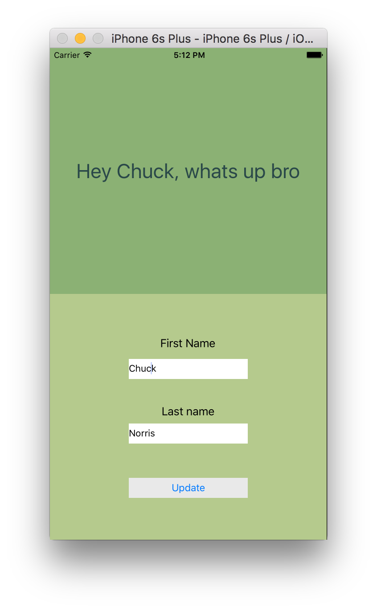

# Building a Native Component in iOS

In this tutorial you're going to learn how to build a Native Component in iOS, that displays 2 input text fields and a button, as well as how to **link those input fields with React properties**, and **firing a React event** when native button gets clicked.

Our final objective is to have a component that we can use from React like this:
```jsx
<UserInput 
    firstName="Chuck" 
    lastName="Norris" 
    onUpdate={someCallback.bind(this)}
/>
```

&nbsp; 

## UserInputView native component
In the iOS xcode project you'll find a folder called **Views**, that contains:
* UserInputView.xib
* UserInputView.h
* UserInputView.m
* UserInputViewManager.m

The first 3 files belong to the Native View we want to use as a React Component, while the last one is a singleton class that acts as a controller, so the Native bridge understands how to use the view.




Most of the code you need to write in order to use the Native View as a React component should be done in the view manager, so let's start!

&nbsp;

## Extend UserInputViewManager and declare module to export

First of all, our *view manager* should extend `RTCViewManager`. This has been done for you in the first lines:

```obj-c
    //UserInputViewManager.m
    @interface UserInputViewManager : RCTViewManager 
```

Then, you have to use `RTC_EXPORT_MODULE()`macro in order to tell React Native it is a Native View:

```obj-c
//UserInputViewManager.m
//Declare it as a React Native Module
RCT_EXPORT_MODULE()
```

&nbsp;

# Add properties to the component

We want to have a ***firstName*** and ***lastName*** properties in our react component, so we have to link them somehow with some Objective-C strings

&nbsp;
## Export properties in UserInputViewManager

In order to do so, we add to our UserInputViewManager:

```obj-c
//UserInputViewManager.m
//export properties
RCT_EXPORT_VIEW_PROPERTY(firstName, NSString)
RCT_EXPORT_VIEW_PROPERTY(lastName, NSString)
```

&nbsp;
## Declare properties in UserInputView

Right now our view manager knows that our native view has 2 properties that should be exposed to the React bridge. However, if we look at our native view, those properties do not exist already, so let`s declare them:

```obj-c
//UserInputView.h
@property (weak, nonatomic) NSString *firstName;
@property (weak, nonatomic) NSString *lastName;
```

In fact, what we want to update the texts of the IBOutlet UITextFields when this properties are changed from react.
In order to do so, we override the setters for our recently created properties the following way:

```obj-c
//UserInputView.m
//connect IBOutlet text with NSStrig properties
- (void)setFirstName:(NSString *)firstName {
  self.firstNameInput.text = firstName;
}

- (void)setLastName:(NSString *)lastName {
  self.lastNameInput.text = lastName;
}
```

&nbsp;
## Create component wrapper on the React side

Right now our component only exists on the Native side. 

Let`s create a file at *src/userInput/userInputView.ios.js* where we are going to declare a wrapper to export the native module as a React component with properties:

```jsx
//src/userInput/userInputView.ios.js
import React, { Component, PropTypes } from 'react';
//custom native components import
import { requireNativeComponent } from 'react-native';


//Wrapper around UserInputView in order to add properties and events
class Wrapper extends Component{
    //TODO:define onUpdate event callback

    render(){
        return <UserInputView {...this.props} />;
    }
}

//define available properties
Wrapper.propTypes = {
    firstName: PropTypes.string,
    lastName: PropTypes.string,
}


//export our custom native view as a react component
var UserInputView = requireNativeComponent('UserInputView', Wrapper);
export default Wrapper;
```

&nbsp;

## Use our wrapper as a React Component

Let's see if our native component works. Open the ***app_base.js*** file, find the `<Text>` component with the text `"REPLACE ME by userInput native component"`, and replace it with our new component, let's call it **UserInput**:

```jsx
//src/app/app_base.js

//import UserInput native component
import UserInput from '../userInput/userInputView';

class App extends Component {
    render(){
        return (
            <View style={styles.container} >
                <Greeting user={this.props.user} style={styles.greeting} textStyle={styles.textStyle} />

                <UserInput style={styles.userInput} 
                    firstName="Chuck" 
                    lastName="Norris" 
                />
            </View>
        );
    }

}
```

&nbsp;

Stop the app, rebuild it and launch it from Xcode.

If you have followed the steps correctly, you should be watching something like this:



Notice how the second half of the screen is displaying our native iOS view. Note however, that if you press the **Update** button, nothing happens. This is because we have not linked any event to the component yet.

&nbsp;

# Add events to component

In order to have a method on our React component that gets fired when something in the native side happens (in this case, when update button is clicked), we need to declare an equivalent method property in the native view, that will be called by the view delegate (the view manager).

&nbsp;
## Declare method property in view

First of all, let's declare in the UserInputView the method property that will be linked to the react event property:

```obj-c
//  UserInputView.h
// ...
@property(nonatomic, copy) RCTBubblingEventBlock onUpdate;
```

&nbsp;
## Declaring the native view delegate

When we click our update button in the **UserInputView**, the `-(IBAction)updateUser` method is called (look at the XIB file in order to see the bindings). In this method we could call the `RCTBubblingEventBlock` we have previously declared, but maybe there's a smarter solution.

In an attempt of separating concerns and make our view agnostic about what kind of data must be sent to the Javascript bridge when this function is called, we define a view delegate with a `onUserInputUpdate` interface, so we can ignore the implementation of the details, and pass that task to the class that implements the delegate (the UserInputViewManager)

This pattern, really used in Objective-c has been already provided to you in this workshop, but lets remark the points of code where it happen:

```obj-c
//  UserInputView.h
@class UserInputView;

@protocol UserInputDelegate <NSObject>
@required
- (void) onUserInputUpdate:(UserInputView*)view;
@end

@interface UserInputView : UIView
//...
@property (weak, nonatomic) id <UserInputDelegate> delegate;
//...
@end
```

```obj-c
//  UserInputView.m
@implementation UserInputView
//...

-(IBAction) updateUser: (id)sender{
  if(self.delegate)
     [self.delegate onUserInputUpdate:self];
}

@end
```

## View Manager becomes the view delegate

As our the connection between the view and the native bridge is done in the *view manager*, there is where we are going to place the related code when calling the event callback, so the view manager must become the delegate of the native view.

This has been also already done for you:

```obj-c
//  UserInputViewManager.m
@interface UserInputViewManager : RCTViewManager<UserInputDelegate>

- (UIView *)view{
  UserInputView* userInputView = [[[NSBundle mainBundle] loadNibNamed:@"UserInputView" owner:nil options:nil] objectAtIndex:0];
  userInputView.delegate = self;
  return userInputView;
}

//delegate methods
- (void) onUserInputUpdate:(UserInputView*)view{
  //TODO: complete method to use callback
}
```
Notice that the `- (UIView *)view` method is being updated in order to assign the current object as the view delegate before returning the view.

Notice also that now our view manager must implement the `-(void)onUserInputUpdate:(UserInputView*)view` method. More on this below.

&nbsp;
## Passing data to the event callback
Once in the delegate, when our delegate method is called, we want to call the view method that is linked with the event property on the react side in order to send JS the user data that has been introduced on the native side. We will pass a NSDictionary with a user object with 2 properties: firstName and lastName.

Let's do it!

```obj-c
//  UserInputViewManager.m
- (void)onUserInputUpdate:(UserInputView*)view
{
    view.onUpdate(@{
                    @"user":@{
                      @"firstName": view.firstNameInput.text,
                      @"lastName": view.lastNameInput.text
                    }
                  });
}
``` 


&nbsp;
## Export method property of the view
The same way we have done it before with the input properties, we have to tell React Native that the **onUpdate RCTBubblingEventBlock property** of our view must be linked with a property of the component, so we have to update our view manager with:

```obj-c
//  UserInputViewManager.m
//export event handler
RCT_EXPORT_VIEW_PROPERTY(onUpdate, RCTBubblingEventBlock)
```

&nbsp;
OK, we are done on the Native side, but we need to do some stuff in the JS side also in order to detect the event with the new user data, and update our redux store so our greeting component displays the updated info.

&nbsp;
## Add event handler on react component wrapper

Open *userInputView.ios.js* and update the wrapper component you've already built in order to use the component event property, and call a wrapper event to propagate the event outside our component:

```jsx
//userInputView.ios.js
//Wrapper around UserInputView in order to add properties and events
class Wrapper extends Component{
    //this is equivalent to the this._onUpdate.bind(this) we are doing on the
    //render method
    //constructor(props) {
    //    super(props);
    //    this._onUpdate = this._onUpdate.bind(this);
    //}

    _onUpdate(event){
        if (!this.props.onUserUpdate) {
            return;
        }
        this.props.onUserUpdate(event.nativeEvent.user);
    }

    render(){
        return <UserInputView {...this.props} onUpdate = {this._onUpdate.bind(this)} />;
    }
}
```

Note that the event handler `_onUpdate` receives an event, and inside this event there's the **nativeEvent** property with the object that has been sent from iOS. In this case, we have the property `event.nativeEvent.user` containing 2 properties (firstName and lastName). 

&nbsp;
> **NOTE:** The event callback on the wrapper side has been renamed to `onUserUpdate` in order to clarify in which moment we are refering to the view component event callback and when are we refering to the wrapper event callback.

&nbsp;

Update also the wrapper propTypes to include the **onUpdate** property:

```jsx
//userInputView.ios.js
//...
Wrapper.propTypes = {
    firstName: PropTypes.string,
    lastName: PropTypes.string,
    onUpdate: PropTypes.func
}
```

&nbsp;
## Use our wrapper event callback from React

Finally, go to **app_base.js** and modify the usage of the **UserInput** component to fire the redux updateUser action with the new user data:

```jsx
class App extends Component {
    render(){
        return (
            <View style={styles.container} >
                //...

                <UserInput style={styles.userInput} 
                    firstName="Chuck" 
                    lastName="Norris" 
                    onUserUpdate={this.props.updateUser.bind(this)}
                />
            </View>
        );
    }

}
```

> If you added a setTimeout in the App constructor during the hands on code section of the workshop to test the Greeting component, you can remove it now.

&nbsp;

Stop the app. Rebuild and run it. If you have followed the steps correctly, your app should be working now. 

The native view UITextField components are populated from React, and then when you click the submit button, the event handler in the React side catches the event and fires a redux updateAction, causing the Greeting user property to get updated.

Then, the greeting react component calls a native module with some new parameters, and waits for the results of the promise in order to assign them to the greeting internal state of the component. When this happens, the greeting message you are watching gets updated ;)  

